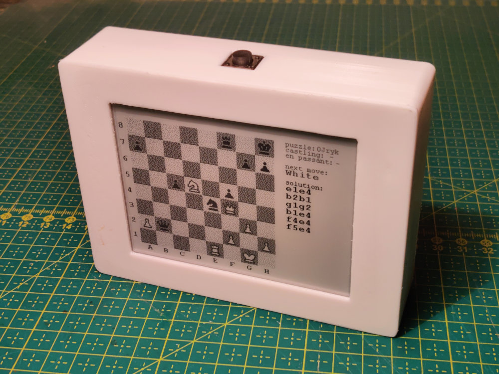

## Chess Puzzle Box with E-Paper Display
This project is a compact, battery-efficient chess puzzle box that uses an e-paper display and a push-button power switch for minimal power consumption. Puzzles are sourced from the Lichess puzzle database.

### Usage:

* First click: Shows a chess puzzle.
* Second click: Reveals the solution.

Perfect for practicing chess tactics on the go, with long battery life thanks to the low-power design.




## hardware setup

---
- 3.7 LiPo battery 
- 4.2 epaper wave share: https://www.waveshare.com/4.2inch-e-paper-module.htm
- adafruit logger RP2040: https://learn.adafruit.com/adafruit-feather-rp2040-adalogger/overview
- adafruit push-button power switch: https://www.adafruit.com/product/1400
- jump wires

## setup:

---
1. install arduino IDE https://www.arduino.cc/
2. install RP2040 board https://learn.adafruit.com/adafruit-feather-rp2040-adalogger/arduino (version 4.4.1)
3. install library for sd card: https://learn.adafruit.com/adafruit-feather-rp2040-adalogger/sd-card-2   
   - (note: 32 GB not working, 8GB working correctly)
4. download epaper library: https://www.waveshare.com/wiki/E-Paper_ESP8266_Driver_Board
   - copy into `~/Arduino/libraries`
   - update `DEV_Config.h` in `~/Arduino/libraries/EPD4in2-lib` to match to board
     ```
     // GPIO config Adalogger RP2040 with 4.2 waveshare epaper
     #define EPD_SCK_PIN  14
     #define EPD_MOSI_PIN 15
     #define EPD_CS_PIN   9
     #define EPD_RST_PIN  11
     #define EPD_DC_PIN   27
     #define EPD_BUSY_PIN 2
     ```
5. wire by attached scheme
6. generate puzzles and config by running `generate-puzzles.sh` (this will create puzzles and config in sd-card folder)
   - copy content of sd-card folder into memory card (root folder)
7. select proper board and port in Arduino IDE
8. upload and enjoy

## SD card:

---
  - should contain `config.txt` file with two numbers. First is the number of lines. Second number of files.
  - list of puzzles accordingly to config files puzzle-1.csv, puzzle-2.csv ... 

## schema:

---


